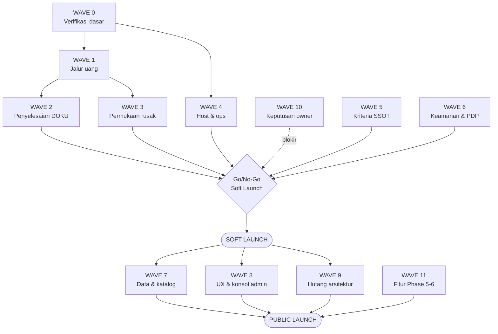

# MASTER EXECUTION PLAN — Jago Akademi

> **Dibuat:** 27 Agustus 2026 · **Basis:** `main @ bd19788` · **Metode:** register kesiapan 26 Agu
> 2026 (audit 2 agent + verifikasi mandiri ke host produksi, sandbox DOKU, dan kode).
>
> **Dokumen ini adalah PROMPT.** Ia ditulis untuk ditempel ke sesi Claude Code baru dan langsung
> dieksekusi. Bagian yang ditujukan ke agen ditandai **`▶ PROMPT`**. Bagian lain adalah konteks yang
> wajib dibaca agen sebelum menyentuh kode.
>
> 🖐️ = **human-gated** (SSOT §9.6). Agen menyiapkan; owner/operator yang mengeksekusi.

---

## §0 — KONTRAK KERJA (baca sebelum apa pun)

**▶ PROMPT — salin blok ini ke awal setiap sesi:**

> Kamu mengerjakan repo Jago Akademi (`c:\dev\Jago-Akademi-Website1`), monorepo Turbo berisi
> `apps/api` (Express + Prisma + PostgreSQL) dan `apps/web` (Next.js 16 + React 19).
>
> **Aturan yang mengikat, dari `CLAUDE.md` dan `PROJECT_PROGRESS_REPORT_V2.md` §9:**
>
> 1. **Satu task = satu branch = satu PR.** Commit atomik, Conventional Commits, subject merujuk ID
>    task (`fix(payment): ... (BL-138)`). Jangan pernah commit langsung ke `main`.
> 2. **Jangan merge, push ke produksi, atau menyentuh host tanpa konfirmasi eksplisit owner.**
>    Aksi sensitif (deploy, DNS/SSL, migration destruktif, transaksi uang nyata) → siapkan config +
>    runbook, lalu berhenti dan minta konfirmasi.
> 3. **Validasi berlapis sebelum menyatakan selesai** (§9.11), berurutan:
>    `tsc --noEmit` bersih → ESLint `--max-warnings 0` → `vitest run` hijau → build → checklist task →
>    self-review diff. Untuk perubahan jalur uang/auth: minta review sebelum merge.
> 4. **Setiap bug fix wajib disertai regression test** yang gagal sebelum perbaikan dan lulus
>    sesudahnya. Test yang sekadar mencerminkan implementasi tidak dihitung — lihat pelajaran BL-137
>    di §0.2.
> 5. **Zod di setiap boundary**, envelope `{success,data,error,meta}` dari `packages/types`, layering
>    Route → Service → Repository, setiap query LMS ter-scope `tenantId`, tak ada file route > 400
>    baris, tak ada `console.log` di produksi (pakai `logger`).
> 6. **Dokumentasi diperbarui dalam PR yang sama** dengan kodenya (docs-as-code, §9.10).
> 7. **Jangan menurunkan threshold coverage.** Naikkan, jangan pernah turunkan.
> 8. **Jangan menambah fitur baru** selama Wave 1–7. Fitur hanya setelah Soft Launch.
>
> **Aturan khusus dokumen ini:**
>
> 9. **`docs/BACKLOG.md` adalah riwayat temuan, BUKAN status terkini.** Sebelum mengerjakan item apa
>    pun, verifikasi dulu bahwa masalahnya masih ada. Pada 26 Agu 2026 tujuh baris terbukti sudah
>    selesai dan angka coverage BL-11 meleset jauh. Status hanya bisa diukur, tidak bisa dibaca.
> 10. **Laporkan apa adanya.** Kalau test gagal, tunjukkan outputnya. Kalau sebuah langkah dilewati,
>     katakan. Jangan menyatakan selesai untuk yang belum terverifikasi.

---

## §0.1 — KOREKSI WAJIB: jangan kerjakan ulang yang sudah beres

Diverifikasi langsung ke host produksi dan sandbox DOKU pada 26 Agu 2026. Baris-baris ini masih
tercatat terbuka di `docs/BACKLOG.md` tetapi **sudah selesai**.

| ID | Kondisi sebenarnya | Bukti |
|---|---|---|
| BL-117 | Backup cron **berjalan**, 25 backup tersimpan | `RESULT=OK ... tables=45` di `/var/log/jago-backup.log` 26 Agu 02:15 |
| BL-119 | Offsite **aktif**, rclone terpasang | `OFFSITE_OK remote_obj=r2:jago-backups/...` |
| BL-114 | Mitigasi **ter-deploy** — `/mentor` 404, flag OFF di host | probe HTTP + `.env` host |
| BL-122 | Lint **bersih**; CI PR #54 hijau termasuk job Lint | `npx eslint app/(public)/berlangganan/page.tsx --max-warnings 0` → exit 0 |
| BL-53, BL-54, BL-56 | Ketiganya **sudah masuk `main`** | `git branch -r --contains` |
| TD-31 (Redis) | Redis **hidup**, worker jalan | `/api/ready` → `redis: "ok"` |
| Cron certbot | Konfigurasi **benar** (`--webroot` + deploy-hook `systemctl reload nginx`). ⚠️ Belum pernah terbukti **berjalan** — sertifikat live `notBefore=2 Jul`, `notAfter=30 Sep`, jadi renewal pertama di bawah konfigurasi ini baru jatuh ~1 Sep. Buktinya masih inspeksi konfigurasi, bukan renewal yang terobservasi. | `/etc/cron.d/certbot-renew` |
| BL-137 | Skema signature **diperbaiki, ter-merge, ter-deploy, terverifikasi di produksi** | ⚠️ Buktinya (`docs/INTEGRATION_VERIFICATION.md` §1.10) **belum ada di `main`** — masih tertahan di branch `docs/bl137-prod-verification` (PR #55). Perbaikan kodenya ada di `main`; catatannya belum. Siapa pun yang mengecek `main` akan menyimpulkan verifikasi produksi tidak pernah terjadi. |

**Coverage — angka BL-11 sudah basi.** Diukur ulang 26 Agu 2026 (`npx vitest run --coverage`):

| Modul | BL-11 (basi) | Terukur | ≥80%? |
|---|---|---|---|
| `trainer.ts` | 37% | **94,4%** | ✅ |
| `webhooks.ts` | 76% | **94,7%** | ✅ |
| `payouts.ts` | <80% | **94,8%** | ✅ |
| `authenticate.ts` | 92% | **91,7%** | ✅ |
| `checkout.ts` | 64% | **90,3%** | ✅ |
| `orders.ts` | 75% | **84,6%** | ✅ |
| **`services/certificate`** | — | **1,36%** | ❌ **produk yang dibeli siswa, praktis nol** |
| **`modules/trainer/*`** | — | **11,9% stmt / 0% branch** | ❌ students, quiz, curriculum, certificates |
| **`dokuService.ts`** | — | **44,7%** | ❌ **jalur uang, praktis tak teruji** |
| `affiliate.ts` | 35% | 49,4% | ❌ |
| `subscription.ts` | 53% | 61,9% | ❌ |
| `modules/admin/coupons.ts` | — | 16,1% | ❌ |
| `modules/admin/reviews.ts` | — | 22,7% | ❌ |

⚠️ **Baca tabel ini dengan hati-hati: angka `routes/*` tidak mewakili modul di belakangnya.**
`routes/trainer.ts` memang 94,4%, tetapi `modules/trainer/*` yang dipanggilnya duduk di 11,9% stmt
dan **0% branch**, dan `services/certificate` di 1,36%. Permukaan trainer/sertifikat bersinggungan
langsung dengan payout, jadi jangan simpulkan ia sehat dari angka route-nya saja.

Global: **69,7% stmt / 58,4% branch / 71,6% func / 71,2% lines**. Ratchet di
`apps/api/vitest.config.ts` ada di 61/58/49/60 — branch hanya lewat tipis.

**Pin dependency terbalik dari catatan SSOT.** SSOT §VI TASK-003 menyebut `apps/web` yang bermasalah.
Per 26 Agu: `apps/web` **0 caret** (bersih), `apps/api` **25 caret**, `packages/eslint-config` 11,
`packages/ui` 4, root 2. Yang tidak reproducible sekarang adalah **API**, bukan web.

---

## §0.2 — PELAJARAN BL-137 (kenapa aturan test di §0 seketat itu)

Skema signature DOKU salah sejak awal: memakai komponen `Request-Body` (tidak ada dalam spesifikasi
DOKU) alih-alih `Request-Target` + `Digest`, tanpa awalan `HMACSHA256=`, dan membaca respons di
`data.payment.url` alih-alih `data.response.payment.url`. **Setiap checkout dan setiap webhook
produksi dipastikan gagal 401.**

Ini lolos berbulan-bulan karena:

- Unit test **menyalin skema dari implementasi**, bukan dari spesifikasi. Self-consistent, jadi tidak
  mungkin menangkap kesalahan bersama.
- Verifikasi 2 Jul 2026 hanya menguji **jalur negatif** (webhook tanpa signature → 401). Jalur positif
  tak pernah diuji terhadap DOKU sungguhan.
- Test integrasi webhook **men-stub `verifyDokuWebhook` agar selalu true**, sehingga membuktikan
  fulfillment tapi tidak pernah membuktikan route memberi verifier input yang benar.

**Aturan turunan yang berlaku untuk seluruh dokumen ini:**

- Test untuk protokol pihak ketiga wajib **mentranskripsikan spesifikasi secara independen**, bukan
  memanggil helper yang sama dengan produksi.
- Setiap integrasi wajib punya **satu test yang menembus route asli**, bukan hanya unit test service.
- Jalur positif wajib diuji, bukan hanya jalur negatif.
- Setelah perbaikan, **kunci skema lama sebagai ditolak** supaya regresi tidak bisa kembali diam-diam.

---

## §0.3 — PETA GERBANG



**Aturan urutan:** Wave 0 mendahului segalanya. Wave 1 → 2 berurutan keras (Wave 2 butuh jalur uang
yang sudah benar). Wave 3, 4, 5, 6 boleh paralel setelah Wave 1. Wave 7–9 hanya setelah Soft Launch.
Wave 10 berjalan paralel sepanjang waktu tetapi **memblokir** Go/No-Go. Wave 11 setelah Public Launch
kecuali item yang eksplisit ditandai pra-launch.

---

# WAVE 0 — VERIFIKASI DASAR

**Prasyarat:** tidak ada. **Membuka:** semua wave lain. **Durasi:** satu sesi.

**Kenapa ada:** dokumen ini pun akan basi. Sebelum mengerjakan apa pun, ukur kondisi nyata.

**▶ PROMPT**

> Jangan menyentuh kode dulu. Ukur dan laporkan kondisi terkini:
>
> 1. `git log --oneline -1` untuk `main` lokal dan `origin/main`; adakah divergensi?
> 2. `cd apps/api && npx tsc --noEmit` — harus bersih.
> 3. `cd apps/api && npx vitest run` — catat jumlah file/test dan kegagalan apa pun.
> 4. `cd apps/api && npx vitest run --coverage` — catat baris `All files` dan setiap modul di bawah 80%.
> 5. `cd apps/web && npm run build` — harus hijau.
> 6. Probe produksi: `curl -s https://jagoakademi.com/api/ready` — ketiga dependensi harus `ok`.
> 7. Untuk setiap item di §0.1, buktikan ulang bahwa ia memang masih selesai.
>
> Laporkan hasilnya sebagai tabel. **Jangan** perbarui `docs/BACKLOG.md` dulu. Kalau ada yang berbeda
> dari §0.1, laporkan perbedaannya sebelum melanjutkan — jangan diam-diam menyesuaikan diri.

**Selesai bila:** semua tujuh terukur dan dilaporkan; setiap penyimpangan dari §0.1 dinyatakan
eksplisit.

---

# WAVE 1 — JALUR UANG

**Prasyarat:** Wave 0. **Membuka:** Wave 2, Wave 3, dan izin menerima uang sungguhan.
**Sifat:** 🔴 **Blocker.** Tidak boleh ada uang sungguhan masuk sebelum wave ini tuntas.

**Kenapa satu wave:** kesembilan cacat ini berbagi satu ciri — **gagal tanpa suara**. Tidak ada
error, tidak ada alarm, uang hilang tanpa jejak. Memperbaiki sebagian justru berbahaya: menambal
BL-142 tanpa BL-138 mengubah "notifikasi hilang" jadi "akses dicabut berulang kali".

### Urutan wajib di dalam wave

```
1.1 BL-139 + BL-142  →  1.2 BL-138 + BL-145  →  1.3 BL-140 + BL-148  →  1.4 BL-141  →  1.5 BL-144  →  1.6 BL-143
```

Alasannya: 1.1 memasang **fondasi bukti** (nominal + payload mentah + penanganan status) yang
dibutuhkan semua langkah sesudahnya; 1.5 (rekonsiliasi) harus terakhir di antara 1.1–1.5 supaya tidak
mewarisi cacat penulisan status dari 1.2.

### 1.1 — Verifikasi nominal & penanganan status (BL-139, BL-142)

**▶ PROMPT**

> Branch `fix/wave1-webhook-amount-and-status`.
>
> **BL-139 — nominal tidak pernah dicocokkan.** Di `apps/api/src/routes/webhooks.ts:26-40`, payload
> DOKU hanya dibaca untuk `order.invoice_number`, `transaction.status`, dan `channel.id`.
> `WebhookJob` (`apps/api/src/jobs/types.ts:47`) tidak membawa nominal, dan
> `processWebhookPayment` tak pernah membaca nominal dari payload — satu-satunya `amount` yang
> disentuh berasal dari `order.finalAmount`. Akibatnya notifikasi SUCCESS memenuhi order berapa pun
> yang sebenarnya disettle.
>
> Kerjakan:
> - Bawa `transaction.amount` dari payload ke `WebhookJob`.
> - Bandingkan dengan **`Math.round(order.finalAmount)`**, bukan Decimal mentah — `checkout.ts:336,338`
>   mengirim nilai yang sudah di-`Math.round` ke DOKU, jadi keduanya sah berbeda hingga 0,5.
> - Bila selisih: **jangan penuhi**, tulis `logger.error` dengan kedua nilai, dan balas non-2xx supaya
>   DOKU retry.
> - Isi `PaymentTransaction.gatewayRaw` (`prisma/schema.prisma:364`) dengan payload mentah. Kolom itu
>   ada sejak awal dan **tak pernah diisi di mana pun** — tanpa itu tidak ada bukti forensik.
>
> **BL-142 — semua kondisi tak tertangani membalas 200.** Titik-titiknya:
> `jobs/processors/webhook.ts:29` (tak ada paymentTransaction), `:38` (order hilang), `:54-60` (order
> cancelled — uang diterima, hanya `logger.warn`, tanpa baris `Refund`), `:334`/`:347` (status di luar
> SUCCESS/FAILED/EXPIRED jatuh ke ujung fungsi tanpa `else`), dan `routes/webhooks.ts:38` (payload
> tanpa invoice/status tak pernah di-enqueue).
>
> Kerjakan:
> - Normalisasi status: `String(status).trim().toUpperCase()`.
> - Tambah cabang `default` eksplisit yang mencatat `logger.error` dan membalas non-2xx.
> - Tangani `REFUND` dan `CHARGEBACK` sebagai pembalikan nyata: cabut akses, balik komisi afiliasi.
>   Bila itu terlalu besar untuk PR ini, minimal buat baris antrean admin + `logger.error`, dan catat
>   sisanya sebagai item backlog baru.
> - Untuk order `cancelled` yang ternyata dibayar: buat baris `Refund` berstatus pending, jangan
>   biarkan hanya jadi baris log.
> - **Balas 200 hanya untuk yang benar-benar diproses.** Sisanya 4xx/5xx agar DOKU mengirim ulang.
>
> **Regression test wajib:** webhook dengan nominal berbeda ditolak; `gatewayRaw` terisi; status
> huruf kecil diterima; `REFUND` tidak lagi diam; order cancelled menghasilkan baris Refund.

### 1.2 — Klaim atomik untuk FAILED/EXPIRED (BL-138, BL-145)

**▶ PROMPT**

> Branch `fix/wave1-expired-overwrite`.
>
> **BL-138.** `apps/api/src/jobs/processors/webhook.ts:334-346` membaca `order.status` dari query di
> `:31` (di luar transaksi apa pun) lalu menjalankan `prisma.order.update` **tanpa syarat**. Cabang
> SUCCESS di `:100-103` sengaja dikeraskan dengan klaim atomik justru karena pembacaan di `:31` basi —
> cabang FAILED/EXPIRED tak pernah kebagian perlakuan sama.
>
> `queues.ts:127` memasukkan `txStatus` ke `jobId`, jadi SUCCESS dan EXPIRED adalah dua job berbeda
> yang berjalan bersamaan (worker konkurensi 5, `worker.ts:38`). Urutan mematikan: EXPIRED membaca
> `pending` → lolos `:337`; SUCCESS mengklaim dan memenuhi; EXPIRED menulis `status: "expired"`.
> Pembeli sudah bayar, komisi dan kupon terpakai, tapi unduhan e-book (`routes/ebooks.ts:74`,`:126`)
> dan hak ulasan (`routes/reviews.ts:115`) di-gate `status === "paid"` ⇒ **akses dicabut**.
>
> Kerjakan: cerminkan `:100-103` — ganti `update` menjadi
> `updateMany({ where: { id, status: { notIn: ["paid","refund_pending","refunded","cancelled"] } } })`.
> Sertakan `refund_pending` — EXPIRED terlambat pada order auto-refund event (`:180`) saat ini menulis
> ulang `refund_pending` → `expired` dan meninggalkan baris `Refund` yatim yang jadi kunci alur
> persetujuan admin (`routes/orders.ts:261-268`).
>
> **BL-145.** `routes/webhooks.ts:11` meneruskan `request-timestamp` langsung ke signature tanpa
> pemeriksaan kesegaran; notifikasi bertanda tangan sah bisa di-replay selamanya, dan replay
> FAILED/EXPIRED adalah pemicu langsung BL-138 tanpa perlu race. Tolak notifikasi di luar jendela
> wajar — **ukur dulu skew nyata dari sandbox DOKU sebelum memilih angkanya**, jangan menebak ±5 menit
> lalu menolak notifikasi sah.
>
> **Regression test wajib, dua arah:** SUCCESS lalu EXPIRED, dan EXPIRED lalu SUCCESS. Keduanya harus
> berakhir `paid`.

### 1.3 — Identitas invoice (BL-140, BL-148)

**▶ PROMPT**

> Branch `fix/wave1-invoice-identity`.
>
> **BL-140.** `checkout.ts:314` membentuk `` `JA-${order.id.slice(0,8).toUpperCase()}` `` dari
> `Order.id @default(uuid())` — 8 hex = 2³², bukan namespace. `schema.prisma:360` mendeklarasikan
> `gatewayTxId String?` **tanpa `@unique`**, dan `webhook.ts:26-29` mencarinya dengan `findFirst` yang
> mengembalikan baris sembarang saat tabrakan. Peluang tabrakan ~1,2% pada 10 rb order, ~29% pada 50 rb.
> Saat tabrakan: pembeli B membayar, SUCCESS teresolusi ke transaksi A ⇒ **A dapat akses gratis, B
> tidak pernah dipenuhi.**
>
> **BL-148.** Dokumentasi DOKU: `invoice_number` maks 64 karakter (30 untuk kartu kredit) dan
> **no symbols for KKI**. Tanda hubung di `JA-` melanggar; kartu kredit akan ditolak semata karena
> format nomor invoice.
>
> Kerjakan sekaligus karena menyentuh baris pembentukan yang sama:
> - Identifier unik tanpa simbol, ≤30 karakter (mis. `JA` + UUID tanpa tanda hubung, atau sequence).
> - `@unique` pada `gatewayTxId` + migration.
> - `findFirst` → `findUnique`.
> - Jalur gratis (`checkout.ts:211`, prefix `FREE-`) punya pemotongan yang sama; rapikan sekalian.
>
> 🖐️ Migration ke produksi butuh konfirmasi owner. Siapkan, jangan jalankan.

### 1.4 — Dead-letter tidak boleh menelan retry (BL-141)

**▶ PROMPT**

> Branch `fix/wave1-webhook-retry`.
>
> `jobs/queues.ts:121-131` menyetel `jobId: webhook:${invoiceNumber}:${txStatus}` sementara
> `defaultJobOptions` (`:19-25`) menyetel `removeOnFail: { count: 5000 }`. `queue.add` BullMQ **no-op
> bila job dengan id itu masih ada dalam keadaan apa pun, termasuk `failed`.** Jadi bila pengiriman
> SUCCESS pertama gagal di kelima percobaan, job mengendap di failed set selamanya; DOKU retry,
> `queue.add` diam-diam mengembalikan job gagal lama, route membalas 200, dan **fulfillment tak pernah
> berjalan**.
>
> Kerjakan: jangan pakai `jobId` deterministik sebagai kunci idempotensi — idempotensi sudah dijamin
> klaim atomik `:100-103`. Sertakan `Request-Id` DOKU di `jobId`, atau hapus job gagal sebelum enqueue
> ulang. Tambahkan alert pada dead-letter; saat ini pemulihan bergantung pada seseorang yang kebetulan
> melihat `job failed` di log worker (`worker.ts:26-28`).

### 1.5 — Rekonsiliasi (BL-144)

**▶ PROMPT**

> Branch `feat/wave1-payment-reconciliation`. **Kerjakan setelah 1.1–1.4 ter-merge.**
>
> `checkout.ts:294` menyetel `expiredAt`; grep `expiredAt` di seluruh `apps/api/src` mengembalikan
> **hanya baris itu**. Tak ada penyapu order pending kedaluwarsa, tak ada rekonsiliasi terjadwal, dan
> `dokuService.ts` hanya mengekspos `createDokuOrder` + `verifyDokuWebhook`.
>
> Konsekuensinya setiap mode gagal di 1.1–1.4 bersifat **terminal**: order yang notifikasinya hilang
> duduk `pending` selamanya. Ini bukan teori — pada 26 Agu 2026 order `JA-FEF61033` dibayar di
> simulator DOKU dan sampai sekarang masih `pending`, karena DOKU tak pernah mengirim notifikasi.
>
> Kerjakan:
> - Job terjadwal yang menyapu order `pending` melewati `expiredAt`.
> - Tanyakan status ke DOKU (status inquiry API — **cari endpoint resminya di developers.doku.com,
>   jangan menebak**; kalau tidak ada, gunakan pendekatan lain dan catat alasannya).
> - Bila DOKU melaporkan sudah dibayar: jalankan fulfillment lewat jalur yang sama dengan webhook,
>   melalui klaim atomik yang sama.
> - Bila kedaluwarsa sungguhan: tandai `expired`, lewat `updateMany` berpredikat dari 1.2.
>
> Ini satu perubahan yang mengubah sebagian besar kegagalan di atas dari kehilangan uang senyap
> menjadi insiden yang bisa dipulihkan. **Prioritaskan tinggi meski labelnya bukan Blocker.**

### 1.6 — Integritas kupon (BL-143)

**▶ PROMPT**

> Branch `fix/wave1-coupon-integrity`.
>
> (a) `routes/orders.ts:214-222` mengurangi `coupon.usageCount` saat order pending dibatalkan, padahal
> sejak perubahan M-coupon order pending **tak pernah menambahnya** — `checkout.ts:309-311`
> mendokumentasikan penambahan pindah ke payment success (`webhook.ts:202-207`). Loop
> buat-lalu-batalkan menurunkan counter sampai lantai 0 (`orders.ts:216` hanya menjaga underflow),
> setelah itu batas di `couponService.ts:22-24` tak pernah aktif ⇒ **kupon bisa dipakai tanpa batas**.
> Perilaku basi ini dikunci asersi di `test/integration/orders/cancel.test.ts:67-69` — perbaikan wajib
> memperbarui test itu.
>
> (b) `couponService.ts:22-24` memeriksa batas saat order pending dibuat, tetapi `webhook.ts:202-207`
> menambah **tanpa syarat** saat fulfillment. 200 pembeli membuat order pending di menit yang sama
> pada kupon `usageLimit: 10` — semuanya lolos validasi — lalu 200 diskon dihormati atas anggaran 10.
>
> Kerjakan: hapus dekremen **atau** kembalikan penambahan ke saat pembuatan — pilih satu, jangan
> dua-duanya. Lalu ganti penambahan jadi `updateMany` berpenjaga
> `OR: [{usageLimit: null}, {usageCount: {lt: usageLimit}}]` dan putuskan perilaku saat penjaga kalah.

### 1.7 — Tutup lubang test jalur uang

**▶ PROMPT**

> Branch `test/wave1-doku-service-coverage`.
>
> `dokuService.ts` hanya **44,7%** coverage; `createDokuOrder` (baris 89–156) praktis tak teruji karena
> melakukan I/O jaringan. Ini fungsi yang menciptakan setiap transaksi uang.
>
> Kerjakan: uji `createDokuOrder` dengan `fetch` yang di-mock — bentuk request body, header, komponen
> signature, penanganan `res.ok === false`, dan parsing `data.response.payment.url` termasuk kasus URL
> kosong. Ikuti aturan §0.2: **transkripsikan spesifikasi DOKU secara independen**, jangan memanggil
> `sign()` milik produksi.
>
> Target: `dokuService.ts` ≥ 80%. Naikkan ratchet di `vitest.config.ts` setelahnya.

**Wave 1 selesai bila:** ketujuh sub-PR ter-merge; `dokuService.ts` ≥80%; seluruh regression test
lulus; `tsc` + ESLint bersih; dan sebuah dokumen ringkas mencatat skenario apa saja yang kini
mustahil terjadi.

---

# WAVE 2 — PENYELESAIAN DOKU

**Prasyarat:** Wave 1. **Membuka:** Go/No-Go Soft Launch.

**Kondisi saat ini (26 Agu 2026):** checkout terbukti bekerja di produksi (`200 SUCCESS`, invoice
terbit, VA terbit). Webhook endpoint terbukti sehat — menerima tanda tangan sah, menolak skema lama
dan yang tanpa tanda tangan. **Tetapi DOKU belum pernah mengirim satu notifikasi pun**; nol request
masuk, dikonfirmasi dari access log nginx termasuk pemantauan live.

### 2.1 — 🖐️ Sambungkan notifikasi DOKU

**Ini bukan pekerjaan kode.** Notification URL sudah didaftarkan di
Settings → Payment Settings → Virtual Account → BCA, tetapi notifikasi tetap tidak datang.

Langkah berikutnya, berurutan:

1. Buka **DOKU Back Office → Reports → Transaction**. Apakah pembayaran simulator tercatat?
   - **Tercatat SUCCESS** → DOKU mencatat tapi tidak mengirim notifikasi ⇒ eskalasi ke DOKU support.
   - **Tidak tercatat** → simulator tidak pernah mendaftarkan pembayaran; halaman "Payment Success"
     simulator secara harfiah menyebut dirinya *mocking the success page*.
2. Bila perlu eskalasi, pertanyaan yang harus diajukan: **apakah konfigurasi Notification URL pada
   channel Virtual Account berlaku juga untuk VA yang diterbitkan melalui produk Checkout, atau
   Checkout memerlukan pendaftaran terpisah?** Dokumentasi DOKU tidak menjawab ini.
3. Bukti yang siap dikirim ada di `docs/INTEGRATION_VERIFICATION.md` §1.10.

### 2.2 — Perbaiki redirect pasca-pembayaran (BL-146, BL-89)

**▶ PROMPT**

> Branch `fix/wave2-doku-redirect`. **Uji dulu, baru perbaiki.**
>
> Objek `order` yang didokumentasikan DOKU berisi persis: `amount`, `invoice_number`, `currency`,
> `callback_url`, `callback_url_cancel`, `callback_url_result`, `language`, `auto_redirect`,
> `disable_retry_payment`, `recover_abandoned_cart`, `expired_recovered_cart`, `line_items`.
> **Tidak ada** `pending_return_url` maupun `failure_return_url` — keduanya dikirim di
> `dokuService.ts:110`,`:115`. Bukti empiris: respons 200 sandbox tidak menggemakan `pending_return_url`
> yang kita kirim. Jadi `/payment/pending` dan `/payment/failed` (dibangun di `checkout.ts:317-325`)
> adalah **kode mati**, dan BL-56 tidak pernah bekerja.
>
> ⚠️ **Jangan langsung perbaiki.** Dokumentasi DOKU **tidak menyatakan** ke mana pembeli gagal atau
> pending diarahkan saat `auto_redirect: true`. Klaim "mereka mendarat di halaman sukses" adalah
> inferensi yang belum diuji.
>
> Urutan:
> 1. Di sandbox: buat order, batalkan pembayaran, catat ke mana DOKU mengarahkan. Ulangi dengan VA
>    tanpa membayar.
> 2. Baru rancang perbaikannya berdasarkan perilaku nyata itu — kandidatnya `callback_url_result`
>    untuk tombol kembali-ke-merchant, dan `callback_url_cancel` yang dokumentasinya menandai
>    **Indodana only**. Pertimbangkan `auto_redirect: false` agar DOKU menampilkan halaman hasilnya
>    sendiri yang membawa status sebenarnya.
> 3. Sekalian BL-89: `failure_return_url` hanya dikirim saat `itemSlug` ada.
> 4. Perbarui baris BL-56 di backlog — klaimnya tidak pernah berlaku.

### 2.3 — Batasi metode pembayaran (BL-147)

**▶ PROMPT**

> Branch `fix/wave2-payment-methods`.
>
> `dokuService.ts:102-106` hanya mengirim `name`, `price`, `quantity` per line item, dan `:117` hanya
> `payment.payment_due_date`. Dokumentasi DOKU menandai `line_items.id` (Akulaku, Kredivo, Indodana,
> Allobank), `.sku` + `.category`, `.url` (Kredivo), `.image_url` (Indodana), `.type` sebagai
> conditional-mandatory, bersama `customer.id`/`phone`/`address`/`postcode`/`city`/`state` dan objek
> `shipping_address`/`billing_address`. Sementara `payment.payment_method_types` **kita hilangkan**,
> yang menurut dokumentasi berarti "tampilkan semua".
>
> Respons sandbox dari host mengonfirmasi **31 metode** ditawarkan, termasuk `PEER_TO_PEER_KREDIVO`,
> `PEER_TO_PEER_AKULAKU`, `PEER_TO_PEER_INDODANA`, `PEER_TO_PEER_BRI_CERIA`. Pembeli yang memilih
> salah satunya menabrak case code 02 "Invalid Mandatory Field" — **setelah** baris order dan
> `paymentTransaction` terlanjur dibuat.
>
> Kerjakan: setel `payment.payment_method_types` ke daftar yang benar-benar didukung (VA, kartu,
> e-wallet). Jadikan daftarnya konfigurabel lewat env supaya tidak perlu deploy untuk mengubahnya.
> Lengkapi field paylater hanya bila owner memang menginginkan paylater.

### 2.4 — Uji end-to-end sungguhan

**▶ PROMPT**

> Setelah 2.1 tersambung: checkout dari situs → bayar di simulator → buktikan order berpindah ke
> `paid`, enrollment terbentuk, email terkirim, dan komisi afiliasi tercatat. Rekam buktinya di
> `docs/INTEGRATION_VERIFICATION.md`. **Ini kriteria SSOT §9.12 "minimal 1 transaksi nyata berhasil"
> — tanpa ini Soft Launch tidak boleh dinyatakan siap.**

---

# WAVE 3 — PERMUKAAN YANG RUSAK

**Prasyarat:** Wave 1 (BL-127 menyentuh alur refund). **Boleh paralel** dengan Wave 2, 4, 5, 6.

Tiga menu yang akan langsung ditemukan pengguna dalam hitungan menit setelah Soft Launch, ditambah
tiga cacat data dashboard.

| Sub | ID | Ringkas |
|---|---|---|
| 3.1 | **BL-125** | `/dashboard/afiliasi` memanggil keempat endpoint tanpa header `Authorization` ⇒ seluruh menu Afiliasi mati. **Bug lapis kedua** muncul segera setelah auth diperbaiki: `GET /api/affiliate/me` tak meng-`include` `referredUser`, sedangkan `page.tsx:311` merender `{c.referredUser.name}` tanpa optional-chaining ⇒ halaman crash begitu affiliate punya ≥1 komisi. **Perbaiki keduanya dalam satu PR** — memperbaiki auth saja menukar "halaman kosong" jadi "halaman crash". |
| 3.2 | **BL-126** | Konsol moderasi ulasan rusak ujung-ke-ujung: empat drift kontrak (`comment` vs `content`, `isApproved` vs `status`, relasi item tak di-`include`, `body.data.total` vs `meta.total`). Akibat paling tajam: **tombol "Cabut" tak pernah bisa dijangkau** — tidak ada cara menurunkan ulasan lewat UI. Ditambah: `Review.status` default `published` tanpa pre-moderasi. |
| 3.3 | **BL-127** | Permintaan refund tidak punya permukaan admin sama sekali. Endpoint `GET/PATCH /api/orders/admin/refunds` ada; grep di `apps/web` = **0 hit**. Pemohon menunggu tanpa batas. Ini wiring UI, bukan fitur baru. |
| 3.4 | **BL-128** | 12 halaman dashboard memakai `getToken()` yang tidak refresh-aware dan tidak menangani 401. Token ber-TTL 15 menit ⇒ tab yang dibiarkan terbuka gagal senyap. Naikkan disiplin `PanelState`: **kegagalan tidak boleh dirender sebagai daftar kosong.** |
| 3.5 | **BL-129** | KPI "Sertifikat" mentok di 5 (`take: 5` lalu `.length`), dan sertifikat tercabut tetap tampil lengkap dengan tombol unduh yang menghasilkan 404. |
| 3.6 | **BL-130** | Tiga KPI admin menyatakan hal yang tidak benar: rating menghitung ulasan tersembunyi, "Kursus Aktif" sebenarnya total kursus, badge "Sistem Online" hardcoded tanpa memanggil apa pun. |

**▶ PROMPT**

> Kerjakan 3.1 → 3.2 → 3.3 lebih dulu (ketiganya menutup menu yang benar-benar mati), lalu 3.4 → 3.5
> → 3.6. Satu branch per sub. Setiap perbaikan drift kontrak wajib disertai **contract test** yang
> mengunci bentuk respons API (ikuti pola `test/integration/contract/`), supaya kelas bug ini tidak
> lahir lagi di halaman berikutnya. Keputusan pre-moderasi ulasan (3.2) adalah **keputusan produk
> owner** — catat, jangan diam-diam diubah karena mengubah perilaku publik.

---

# WAVE 4 — HOST & OPERASI

**Prasyarat:** Wave 0. **Boleh paralel** dengan Wave 1–3. **Sebagian besar 🖐️ human-gated.**

| Sub | Item | Kondisi | Aksi |
|---|---|---|---|
| 4.1 | **BL-123** migration index FK | 1 dari 15 migration belum di-apply | 🖐️ `prisma migrate deploy`. DDL index-only, nol perubahan data. Ambil backup dulu. |
| 4.2 | **Restore drill** | Backup terbukti jalan; **belum pernah dicoba dipulihkan** | 🖐️ Pulihkan satu backup ke database sekali-pakai, hitung baris, bandingkan. Kriteria SSOT Phase 3. |
| 4.3 | **BL-118** dump di working tree | Dump berisi data pengguna nyata + `.env.bak` masih di direktori repo produksi, untracked tapi tak ter-gitignore | 🖐️ Pindahkan ke luar repo. Perbaikan `.gitignore` ada di branch `fix/p0-ops-backup` yang **belum ter-push** — push atau tulis ulang. |
| 4.4 | **BL-17** Sentry web | API sudah ber-DSN; `NEXT_PUBLIC_SENTRY_DSN` kosong | Instrumentasi Next.js + isi env + rebuild image web (DSN di-inline saat build). |
| 4.5 | **Monitor & alert** | Belum ada alert error-rate, p95, kegagalan pembayaran, kedalaman antrean | 🖐️ Arahkan uptime monitor ke `/api/health`. Kriteria SSOT Phase 3. |
| 4.6 | **BL-30** login Google | Kredensial + redirect URI belum didaftarkan di host | 🖐️ Google Cloud Console + env host. |
| 4.7 | **BL-31** email verifikasi | Kode siap; `RESEND_API_KEY` **sudah terisi** di host per 26 Agu | Verifikasi ulang apakah masih relevan sebelum mengerjakan. |
| 4.8 | **BL-101** e-book legacy | Baris `fileUrl` lama belum dimigrasikan | 🖐️ Butuh akses data produksi. |
| 4.9 | **BL-111** audit peran | Query audit `user_roles` pra-deploy | 🖐️ Jalankan sebelum deploy berikutnya. |
| 4.10 | **BL-40** header ganda | Security header didefinisikan di nginx **dan** helmet dengan nilai bertentangan | 🖐️ Satukan di satu lapis. |
| 4.11 | **Rollback drill** | Belum pernah diuji | 🖐️ Kriteria SSOT TASK-020. |
| 4.12 | **BL-35 / BL-75** | Residu keduanya adalah rebuild image web `--no-cache` | Ikut sertakan di deploy berikutnya. |

**▶ PROMPT**

> Untuk setiap item 🖐️: **siapkan perintah lengkap + runbook + rencana rollback, lalu BERHENTI dan
> minta konfirmasi owner.** Jangan eksekusi sendiri. Untuk 4.1 khususnya: ambil backup dan buktikan
> validitasnya sebelum meminta izin, dan sertakan `prisma migrate status` sebelum-sesudah dalam
> laporan. Perhatikan jebakan yang terdokumentasi di `docs/RUNBOOK_DB.md` §1.1: image basi bisa membuat
> `migrate status` berbohong.

---

# WAVE 5 — KRITERIA FORMAL SSOT

**Prasyarat:** Wave 1 (coverage jalur uang naik di sana). **Memblokir:** penandaan Phase 1 dan 2
sebagai selesai.

| Sub | Item | Target |
|---|---|---|
| 5.1 | **Pin dependency** (TASK-003) | `apps/api` **25 caret**, `packages/eslint-config` 11, `packages/ui` 4, root 2. `apps/web` sudah bersih. Pin exact, commit lockfile, `npm ci` reproducible. ⚠️ Catatan SSOT tentang `apps/web` sudah terbalik — perbaiki catatannya sekalian. |
| 5.2 | **BL-11 / BL-41 coverage** | Yang masih di bawah 80%: `dokuService` 44,7% (ditangani Wave 1.7), **`services/certificate` 1,36%**, **`modules/trainer/*` 11,9% stmt / 0% branch**, `affiliate` 49,4%, `subscription` 61,9%, `admin/coupons` 16,1%, `admin/reviews` 22,7%. Naikkan ratchet setiap kali naik. **Prioritaskan `services/certificate` dan `modules/trainer/*`** — keduanya bersinggungan dengan payout dan dengan produk yang dibeli siswa, dan keduanya tak pernah tercatat di BL-11. |
| 5.3 | **BL-15 npm audit** | 1 high + 1 moderate tanpa forward-fix. SSOT menuntut audit bersih. Keputusan owner: terima dan pantau, atau cari mitigasi. |
| 5.4 | **BL-12 Zod boundary** | `parsePageParams` belum diadopsi di semua tempat; query/param belum tervalidasi menyeluruh. |
| 5.5 | **BL-80 test non-deterministik** | 1–6 kegagalan acak di bawah beban CPU. Kriteria SSOT: test harus deterministik. Cari akar penyebabnya, jangan naikkan timeout. |
| 5.6 | **E2E ≥ 20 skenario** | Kriteria TASK-010. Hitung skenario Playwright yang ada, lengkapi kekurangannya. |

---

# WAVE 6 — KEAMANAN & KEPATUHAN

**Prasyarat:** Wave 0. **Sebagian ditandai pra-launch oleh SSOT.**

| Sub | Item | Ringkas |
|---|---|---|
| 6.1 | **BL-20** | Consent disimpan tanpa versi kebijakan ⇒ tidak bisa memicu re-consent. Pra-launch. |
| 6.2 | **BL-21** | Alur respons pelanggaran PDP 3×24 jam butuh formalisasi hukum. 🖐️ Keputusan owner. |
| 6.3 | **BL-22** | Transfer lintas negara belum dinilai; DPA per prosesor perlu ditinjau. 🖐️ Keputusan owner. |
| 6.4 | **BL-18** | Belum ada endpoint akses/ekspor data (PDP Pasal 5–6). |
| 6.5 | **BL-19** | Belum ada kebijakan retensi; `AuditLog` menumpuk tanpa batas. |
| 6.6 | **BL-16** | CSP belum berbasis nonce; masih `unsafe-inline`/`unsafe-eval`. |
| 6.7 | **BL-91** | Nama pengguna diinterpolasi mentah ke template email HTML tanpa escaping. |
| 6.8 | **BL-102** | Endpoint e-book publik masih membocorkan `fileUrl` di list, detail, dan `/my`. |
| 6.9 | **BL-108** | Prisma `contains` tidak meng-escape metakarakter LIKE pada `?search=` publik. |
| 6.10 | **BL-68** | `GET /api/events/:slug/registration` tidak menyaring status event ⇒ kebocoran keberadaan. |
| 6.11 | **BL-37** | Tak ada feature flag sisi API; endpoint live tidak bisa dimatikan dari server. |

**▶ PROMPT**

> 6.7–6.10 adalah perbaikan kecil dengan dampak nyata; kerjakan lebih dulu. 6.1, 6.4, 6.5 menyentuh
> skema data — rancang bersama supaya migrationnya sekali jalan. 6.2 dan 6.3 bukan pekerjaan kode:
> siapkan ringkasan yang bisa dibawa owner ke penasihat hukum, jangan mengarang kebijakan sendiri.

---

# WAVE 7 — DATA & KATALOG *(setelah Soft Launch)*

| Sub | Item | Ringkas |
|---|---|---|
| 7.1 | **BL-92** | `listCourses` mengembalikan `total` salah di jalur Meilisearch ⇒ paginasi pencarian berhenti. |
| 7.2 | **BL-103** | E-book tidak diindeks di Meilisearch ⇒ katalog berbayar tak terlihat di pencarian global. |
| 7.3 | **BL-104** | Tak ada endpoint unggah PDF; `EBook.fileUrl` hanya bisa diisi URL pihak ketiga. |
| 7.4 | **BL-106** | Checkout e-book tanpa penjaga "sudah dibeli" ⇒ pembelian berulang dengan kupon 100%. |
| 7.5 | **BL-107** | `EBook.totalSold` bruto, tak pernah dikurangi saat refund. 🖐️ Keputusan produk. |
| 7.6 | **BL-109** | Tak ada paginasi kelas gratis ⇒ kursus ke-9 tak terjangkau. |
| 7.7 | **BL-110** | Kursus Rp 0 tetap dirender sebagai transaksi pembayaran ber-badge DOKU. |
| 7.8 | **BL-116** | `Course.publishedAt` null pada semua kursus hasil seed ⇒ urutan admin tak tentu. Perlu backfill + perbaikan `seed.ts`. |
| 7.9 | **BL-79** | Tak ada halaman detail kursus yang bisa diindeks; mitigasi sitemap sudah dipasang, akar masalah terbuka. |
| 7.10 | **BL-105** | Dua halaman e-book memakai strategi transport berbeda. |

---

# WAVE 8 — UX & KONSOL ADMIN *(setelah Soft Launch)*

| Sub | Item | Ringkas |
|---|---|---|
| 8.1 | **BL-134** | Konsol admin tak punya sistem notifikasi; `/admin/kursus` memakai **12 `alert()`** browser, termasuk untuk jalur persetujuan konten. Kerjakan bersama BL-128. |
| 8.2 | **BL-131** | Dua query dashboard tumbuh linear: seluruh riwayat order berbayar ditarik ke memori; enrollment membawa array progress yang tak pernah dipakai UI. |
| 8.3 | **BL-132** | `GET /api/admin/revenue` yatim — endpoint lengkap, grep di web = 0 hit. Sambungkan atau hapus. |
| 8.4 | **BL-133** | CTA "Lihat Leads Baru" mengirim `?status=new` yang diabaikan halaman tujuan. |
| 8.5 | **BL-135** | Admin dan trainer terkunci keluar dari dashboard member miliknya sendiri. 🖐️ Keputusan UX. |
| 8.6 | **BL-83** | `lms_admin` tak di-redirect ke mana pun saat login. 🖐️ Keputusan UX. |
| 8.7 | **BL-88** | `/trainer-hub` tak punya tautan berlabel di mana pun. |
| 8.8 | **BL-82** | Sidebar portal LMS didefinisikan di dalam page ⇒ sub-halaman kehilangan navigasi. |
| 8.9 | **BL-84** | Halaman pesanan terbelah di dua route tree; detail di luar shell dashboard. |
| 8.10 | **BL-87** | Breadcrumb admin melabeli UUID apa pun "Detail Tenant". |
| 8.11 | **BL-93** | Shell admin memeriksa role `"admin"` yang bukan anggota `ROLES`. |
| 8.12 | **BL-76** | Endpoint pemberian peran ada, UI admin untuk memanggilnya tidak ada. |
| 8.13 | **BL-57** | Tak ada jalur "kirim ulang email verifikasi" di UI. |
| 8.14 | **BL-08** | 13 elemen ``; aturan `no-img-element` dimatikan menunggu loader CDN. |

---

# WAVE 9 — HUTANG ARSITEKTUR *(setelah Soft Launch)*

| Sub | Item | Ringkas |
|---|---|---|
| 9.1 | **BL-121** | `@repo/types`/`utils` menunjuk `main` ke `dist/` yang di-gitignore, dan **tak satu pun Dockerfile membangunnya**. Belum meledak hanya karena tak ada import runtime. Import pertama yang sungguhan akan mematahkan build Docker di CI padahal build lokal hijau. **Kerjakan sebelum ada yang mengimpornya.** |
| 9.2 | **BL-99** | `@repo/types` EBook ditulis ulang; `dist/` belum dibangun. Terkait 9.1. |
| 9.3 | **BL-13** | Envelope respons ada di `apps/api/src/types`, belum dikonsolidasi ke `@repo/types`. |
| 9.4 | **BL-39** | Logika payout terduplikasi; sisi afiliasi masih Prisma inline di `routes/affiliate.ts`. |
| 9.5 | **BL-66 / BL-78g** | `EventRegistration.orderId` dan `Refund.orderId` masih String polos, bukan FK. |
| 9.6 | **BL-120** | `docker-compose.prod.yml` build-args menyimpang dari `vps.yml` ⇒ semua feature flag OFF pada image yang dibangun darinya. |
| 9.7 | **BL-43** | 🖐️ Keputusan: ganti nama atau hapus `docker-compose.prod.yml` supaya tak bisa dipakai keliru lagi (pernah menyebabkan 502 sitewide). |
| 9.8 | **BL-10** | `tsconfig.test.json` melonggarkan `noUncheckedIndexedAccess` untuk mock. |
| 9.9 | **BL-09** | `console.error` di `apps/web/app/error.tsx` melanggar aturan no-console. |
| 9.10 | **BL-42** | Rate limiter dinaikkan 100→500/15 menit tanpa evaluasi kapasitas. |
| 9.11 | **BL-136 / BL-50** | BL-50 sudah basi dan mengarahkan perencanaan ke pekerjaan yang sudah selesai. Verifikasi ulang halaman demi halaman. |
| 9.12 | **BL-96** | Residu gate unduhan e-book, tertutup lewat BL-101 + BL-104. |

---

# WAVE 10 — KEPUTUSAN OWNER *(paralel; memblokir Go/No-Go)*

Bukan pekerjaan teknis. Masing-masing punya dua jalan yang hasilnya berbeda, dan memilih diam-diam
akan mengunci keputusan yang seharusnya milik owner.

| ID | Keputusan | Kenapa tidak boleh diputuskan agen |
|---|---|---|
| **BL-85 / BL-122** | Harga paket langganan: hardcoded di kode, atau diambil dari database | Jalur uang. Hardcoded berarti harga yang dilihat calon pelanggan bisa menyimpang dari yang benar-benar menagih. |
| **BL-114** | Halaman mentor: hapus, atau isi mentor nyata ber-consent | Sudah aman (404), tapi halamannya kosong sampai diputuskan. |
| **BL-124** | Nama tutor fiktif di `data.ts`, dirender `CategoryHero.tsx:62,66` | Memblokir flip flag LEARNING_PATH. |
| **BL-32** | Video/berkas di disk lokal tanpa signed URL | Wajib selesai sebelum menjual konten berbayar (TASK-098). Terima untuk launch non-berbayar, atau blokir. |
| **BL-55** | `/marketplace` dan `/ebook` menyajikan data identik | Gabungkan, atau bangun marketplace sungguhan (TASK-042). |
| **BL-112** | Formula payout & bagi hasil 70/30 belum dikonfirmasi ke pihak berkontrak | Sebelum trainer pertama mencairkan uang nyata. |
| **BL-47 / BL-48** | Private Class & Alumni sudah jadi, menunggu konten | Kirim materi, lalu flag dinyalakan. |
| **BL-63b** | Peserta event dapat sertifikat atau tidak | Mengunci perilaku sistem. |
| **BL-107** | Angka terjual: bruto atau neto setelah refund | Sama. |
| **BL-38** | Batas ruang lingkup HRIS vs TD-26 "ringan" | Risiko scope creep. |
| **BL-36 / BL-51** | SSOT belum memuat task Phase 6; `/kelas-gratis` masih drift | 🖐️ Reviewer menyinkronkan SSOT. |
| **BL-15** | Terima risiko `npm audit` atau blokir | SSOT menuntut audit bersih. |

---

# WAVE 11 — FITUR PHASE 5–6 *(setelah Public Launch)*

Semua **NOT STARTED** menurut SSOT §VI.

**Phase 5:** TASK-040 landing akuisisi + lead capture · TASK-050 sinkronisasi docs + OpenAPI ·
TASK-051 Security P2 (CSP nonce, 2FA/OTP, UI sesi, audit PDP) · TASK-093 langganan all-access ·
TASK-095 social proof (memblokir empty-state TASK-052, BL-24) · TASK-096 kelas singkat gratis.

**Phase 6:** TASK-041 analytics + North Star · TASK-042 marketplace unit-6 (**wajib dipecah jadi ≥5
subtask**, terblokir TASK-098) · TASK-043 push + CRM + drip · TASK-090 Learning Path (terblokir
BL-124, BL-115) · TASK-091 bootcamp · TASK-092 komunitas · TASK-094 HRIS ringan · TASK-097 gamifikasi.

**Gate Public Launch:** TASK-098 (R2 + signed URL) wajib selesai · load test lulus · runbook insiden
pernah dijalankan sungguhan.

---

## §99 — TEMPLATE PROMPT PER ITEM

**▶ PROMPT — pakai untuk item mana pun di dokumen ini:**

> Kerjakan **{ID}** dari `docs/MASTER_EXECUTION_PLAN.md` Wave {N}.
>
> 1. **Verifikasi dulu bahwa masalahnya masih ada.** Baca kode di lokasi yang disebut. Kalau ternyata
>    sudah beres, katakan dan berhenti — jangan mengarang perbaikan untuk masalah yang tidak ada.
> 2. Baca §0 (kontrak kerja) dan §0.2 (pelajaran BL-137) sebelum menulis test.
> 3. Buat branch `{tipe}/{slug}` dari `main` yang sudah ter-update.
> 4. Tulis **regression test lebih dulu**: harus gagal karena bug ini, bukan karena hal lain.
> 5. Perbaiki. Diff sesempit mungkin — jangan menumpangkan perbaikan lain.
> 6. Validasi berlapis: `tsc --noEmit` → ESLint `--max-warnings 0` → `vitest run` → build.
> 7. Perbarui `docs/BACKLOG.md` **di PR yang sama**. Jangan hapus prosa aslinya — tambahkan blok
>    koreksi bertanggal, mengikuti pola yang sudah ada di file itu.
> 8. Commit Conventional, subject merujuk ID. Buka PR dengan badan yang memuat: masalahnya, buktinya,
>    perbaikannya, cara verifikasi, dan **apa yang masih belum terbukti**.
> 9. **Berhenti. Jangan merge, jangan deploy.** Laporkan dan tunggu konfirmasi.
>
> Kalau di tengah jalan kamu menemukan cacat lain: catat di `docs/BACKLOG.md` sebagai item baru,
> **jangan** kerjakan di luar urutan kecuali ia P0 atau memblokir pekerjaan ini.

---

## §100 — CARA MELAPOR

Setiap akhir sesi, laporkan dengan format ini:

```
WAVE {N} — {sub}
  Dikerjakan   : {ID}, {ID}
  Branch       : {nama}
  Test         : {n} lulus / {n} gagal   ← angka nyata, bukan perkiraan
  tsc          : bersih / {n} error
  ESLint       : 0 warning / {n}
  Terverifikasi: {apa yang benar-benar dibuktikan, dan bagaimana}
  BELUM terbukti: {apa yang tidak diuji dan kenapa}
  Berikutnya   : {ID}
  Butuh owner  : {apa yang human-gated, kalau ada}
```

Baris **BELUM terbukti** tidak boleh kosong kecuali memang benar-benar tidak ada. Pelajaran BL-137:
klaim "terverifikasi" yang hanya menguji separuh jalur adalah cara paling mahal untuk salah.
